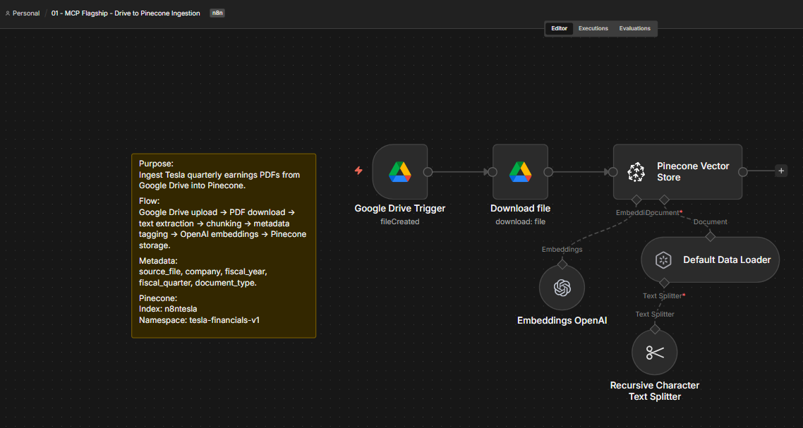
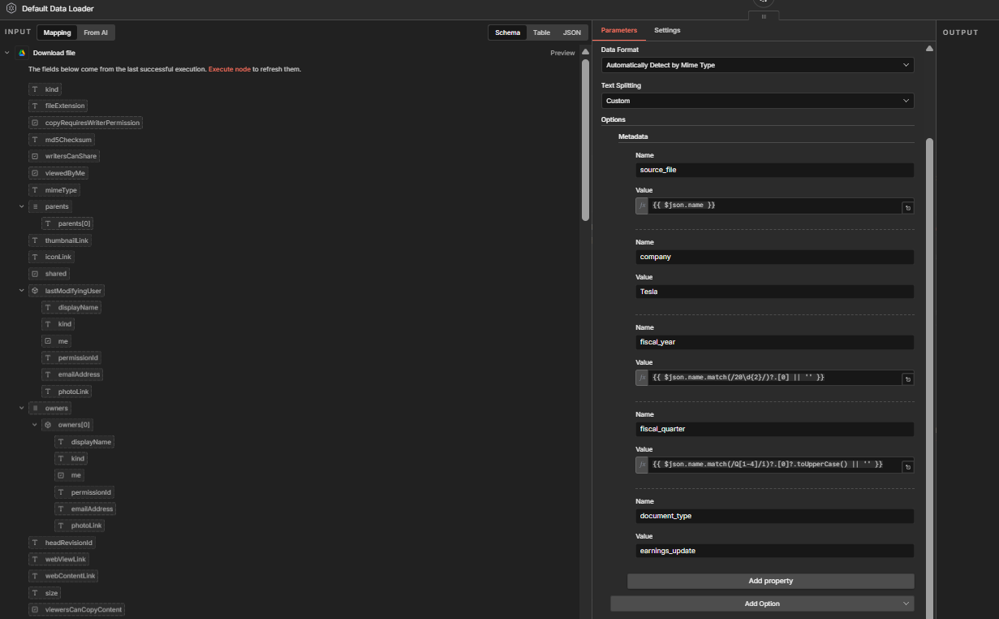
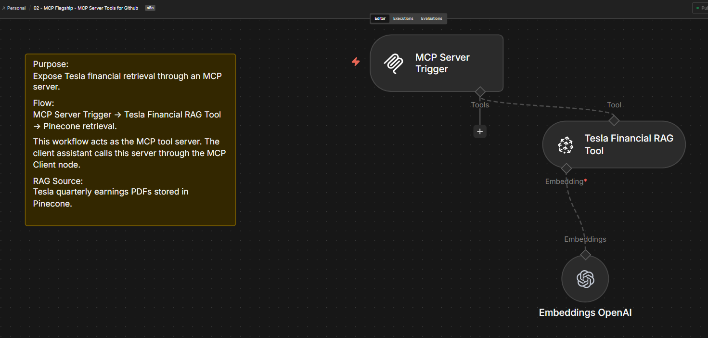
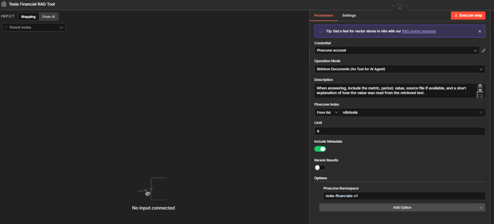

# AI Orchestration System using MCP, RAG, and n8n

This project demonstrates an AI orchestration system built with n8n, MCP, Pinecone, OpenAI embeddings, Google Drive, and structured logging.

The goal is to show how an AI assistant can use a clean multi-workflow architecture to ingest documents, expose retrieval tools through MCP, answer user questions with source-grounded responses, and log interactions for observability.

## Project Status

This repository is being built in stages.

Current workflows included:

1. `01-drive-to-pinecone-ingestion.json`
2. `02-mcp-server-tools.json`

Coming next:

3. `03-client-assistant.json`

## Architecture Overview

The final system is designed as three separate workflows:

```text
Google Drive PDF Upload
        ↓
PDF Download and Text Extraction
        ↓
Chunking and Metadata Tagging
        ↓
OpenAI Embeddings
        ↓
Pinecone Vector Store
        ↓
MCP Server Tool
        ↓
Client Assistant
        ↓
Structured Answer and Interaction Logging
```

## Workflow 1: Drive to Pinecone Ingestion

**File:** `workflows/01-drive-to-pinecone-ingestion.json`

**Purpose:**

This workflow watches a Google Drive folder for newly uploaded Tesla quarterly earnings PDFs. When a new file is added, the workflow downloads the PDF, extracts the text, splits it into chunks, adds structured metadata, generates embeddings with OpenAI, and stores the vectors in Pinecone.

This workflow represents the ingestion layer of the system.

### Workflow Screenshot



### Metadata Configuration



### Pinecone Namespace and Record Count


### Pinecone Expanded Record Metadata


## Workflow 1 Metadata Strategy

Each document chunk is tagged with:

```text
source_file
company
fiscal_year
fiscal_quarter
document_type
```

The `fiscal_year` and `fiscal_quarter` fields are extracted from the file name using n8n JavaScript expressions and regex.

Example filename:

```text
TSLA-Q1-2026-Update.pdf
```

Generated metadata:

```text
source_file: TSLA-Q1-2026-Update.pdf
company: Tesla
fiscal_year: 2026
fiscal_quarter: Q1
document_type: earnings_update
```

## Workflow 2: MCP Server Tools

**File:** `workflows/02-mcp-server-tools.json`

**Purpose:**

This workflow exposes the Tesla financial retrieval layer through an MCP server. It allows an MCP client to call a dedicated Tesla Financial RAG Tool and retrieve grounded answers from Tesla quarterly earnings documents stored in Pinecone.

This workflow represents the tool server layer of the system.

**Flow:**

```text
MCP Server Trigger
        ↓
Tesla Financial RAG Tool
        ↓
OpenAI Embeddings
        ↓
Pinecone Vector Store Retrieval
```

**Main Tool:**

`Tesla Financial RAG Tool`

This tool is designed to answer questions about Tesla financial and operational metrics, including revenue, automotive revenue, energy generation and storage, services revenue, gross profit, operating income, operating margin, deliveries, production, cash flow, expenses, profitability, year-over-year changes, and quarterly comparisons.

**RAG Configuration:**

```text
Pinecone index: n8ntesla
Pinecone namespace: tesla-financials-v1
Retrieval mode: retrieve-as-tool
Top K: 6
```

**Tool Behavior:**

The tool is instructed to avoid unsupported answers. If the requested metric or period is not clearly present in the retrieved context, the assistant should say that the source documents do not contain enough evidence to answer confidently.

For Tesla financial answers, the tool should return:

```text
Answer
Evidence
Source
Confidence
```

### MCP Server Workflow Screenshot



### Tesla RAG Tool Configuration



## Technologies Used

```text
n8n
MCP
Google Drive
OpenAI Embeddings
Pinecone Vector Database
RAG
Google Sheets
```

## Setup Notes

Before running the workflows, configure your own credentials in n8n:

```text
Google Drive OAuth2 credential
OpenAI credential
Pinecone credential
Header authentication credential for MCP
Google Drive folder ID
Pinecone index and namespace
```

The public workflow JSON files use placeholder values for credentials, folder IDs, and MCP paths.

Example placeholders:

```text
YOUR_GOOGLE_DRIVE_CREDENTIAL_ID
YOUR_GOOGLE_DRIVE_FOLDER_ID
YOUR_OPENAI_CREDENTIAL_ID
YOUR_PINECONE_CREDENTIAL_ID
YOUR_HEADER_AUTH_CREDENTIAL_ID
YOUR_MCP_SERVER_PATH
YOUR_MCP_SERVER_WEBHOOK_ID
```

## Pinecone Configuration

The workflows are configured to use:

```text
Index: n8ntesla
Namespace: tesla-financials-v1
```

These values can be changed after importing the workflows into n8n.

## Why This Project Matters

This project demonstrates several skills relevant to AI automation and n8n workflow engineering:

```text
Document ingestion pipeline design
RAG architecture
Vector database integration
Metadata extraction
Credential hygiene
MCP server design
Workflow modularity
AI tool orchestration
Production-style workflow separation
```

## Next Steps

Planned additions:

```text
Client Assistant workflow using the MCP Client
Google Sheets interaction logging
Screenshots and demo video
Architecture documentation
```

## Repository Structure

```text
ai-orchestration-mcp-rag-n8n/
  README.md
  workflows/
    01-drive-to-pinecone-ingestion.json
    02-mcp-server-tools.json
  screenshots/
    01-drive-to-pinecone-ingestion-workflow.png
    02-metadata-configuration.png
    03-pinecone-namespace-record-count.png
    04-pinecone-expanded-record-metadata.png
    05-mcp-server-tools-workflow.png
    06-tesla-rag-tool-configuration.png
  docs/
```

## Author

Built by Boris Villanueva as part of an AI automation portfolio focused on n8n, MCP, RAG, and workflow orchestration.
