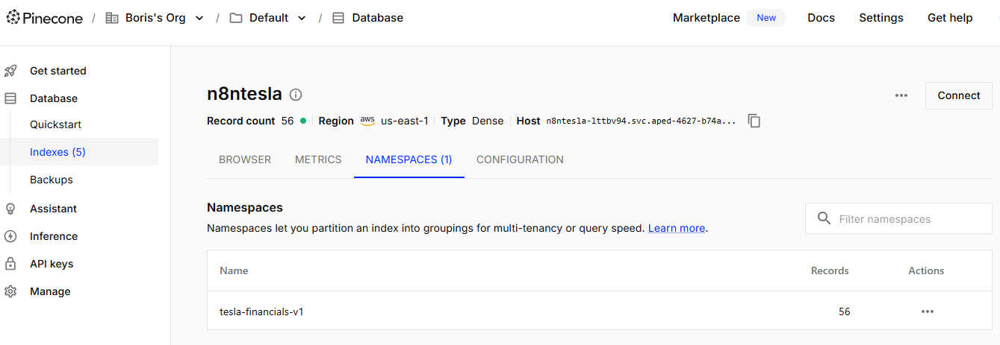
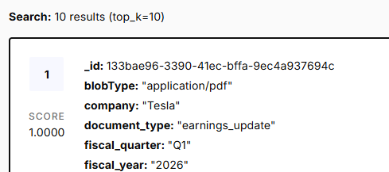
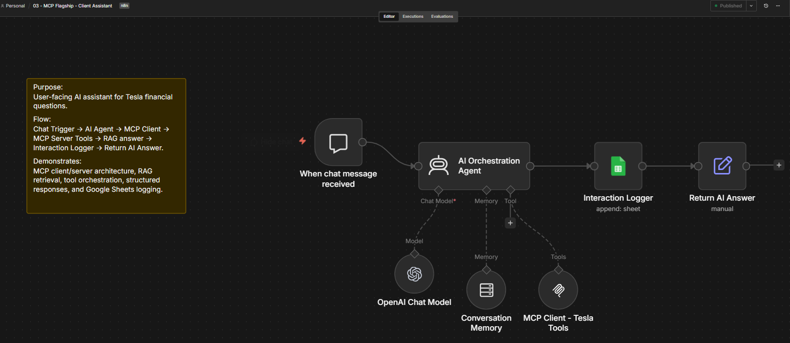
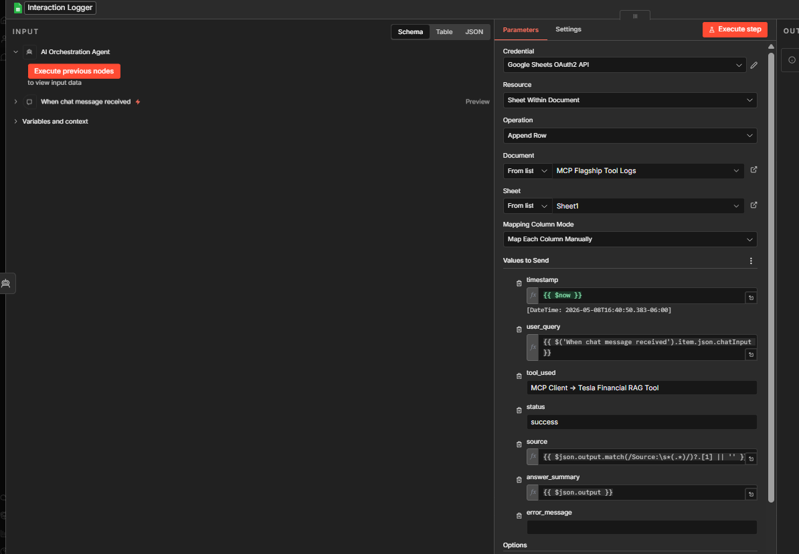
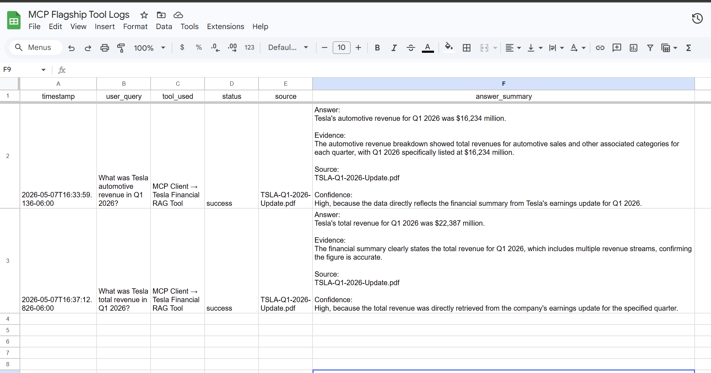
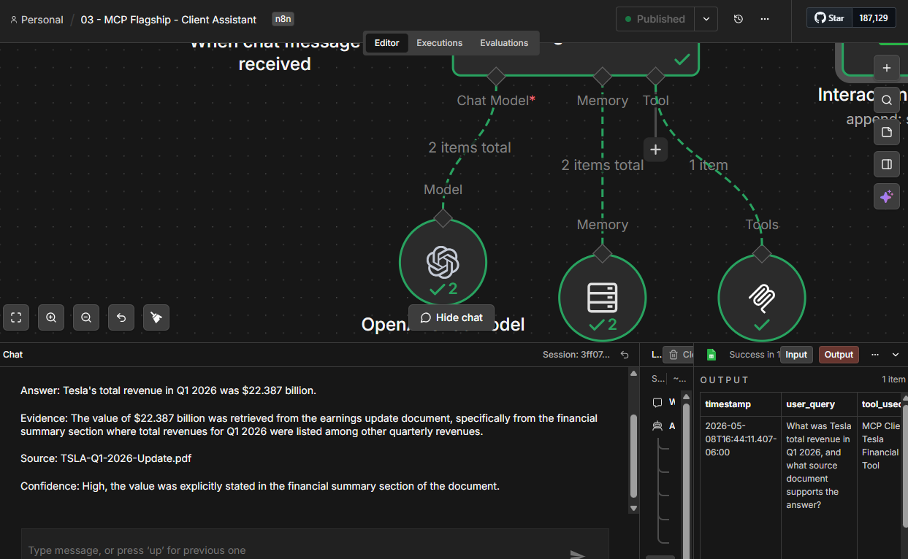

# AI Orchestration System using MCP, RAG, and n8n

This project demonstrates an AI orchestration system built with n8n, MCP, Pinecone, OpenAI embeddings, Google Drive, Google Sheets, and structured logging.

The goal is to show how an AI assistant can use a clean multi-workflow architecture to ingest documents, expose retrieval tools through MCP, answer user questions with source-grounded responses, and log interactions for observability.

## Project Status

This repository includes three workflows:

1. `01-drive-to-pinecone-ingestion.json`
2. `02-mcp-server-tools.json`
3. `03-client-assistant.json`

Together, these workflows demonstrate a complete MCP-based RAG system:

```text
Document ingestion
        ↓
Vector database storage
        ↓
MCP tool server
        ↓
Client assistant
        ↓
Structured answer
        ↓
Interaction logging
```

## Architecture Overview

The system is designed as three separate workflows:

```text
Google Drive PDF Upload
        ↓
PDF Download and Text Extraction
        ↓
Chunking and Metadata Tagging
        ↓
OpenAI Embeddings
        ↓
Pinecone Vector Store
        ↓
MCP Server Tool
        ↓
Client Assistant
        ↓
Structured Answer and Interaction Logging
```

This separation keeps the ingestion layer, tool server layer, and user-facing assistant layer independent and easier to maintain.

## Workflow 1: Drive to Pinecone Ingestion

**File:** `workflows/01-drive-to-pinecone-ingestion.json`

**Purpose:**

This workflow watches a Google Drive folder for newly uploaded Tesla quarterly earnings PDFs. When a new file is added, the workflow downloads the PDF, extracts the text, splits it into chunks, adds structured metadata, generates embeddings with OpenAI, and stores the vectors in Pinecone.

This workflow represents the ingestion layer of the system.

### Workflow Screenshot


### Metadata Configuration


### Pinecone Namespace and Record Count



### Pinecone Expanded Record Metadata



## Workflow 1 Metadata Strategy

Each document chunk is tagged with:

```text
source_file
company
fiscal_year
fiscal_quarter
document_type
```

The `fiscal_year` and `fiscal_quarter` fields are extracted from the file name using n8n JavaScript expressions and regex.

Example filename:

```text
TSLA-Q1-2026-Update.pdf
```

Generated metadata:

```text
source_file: TSLA-Q1-2026-Update.pdf
company: Tesla
fiscal_year: 2026
fiscal_quarter: Q1
document_type: earnings_update
```

This metadata makes retrieval more traceable because each chunk keeps information about the original source document, fiscal period, company, and document type.

## Workflow 2: MCP Server Tools

**File:** `workflows/02-mcp-server-tools.json`

**Purpose:**

This workflow exposes the Tesla financial retrieval layer through an MCP server. It allows an MCP client to call a dedicated Tesla Financial RAG Tool and retrieve grounded answers from Tesla quarterly earnings documents stored in Pinecone.

This workflow represents the MCP tool server layer of the system.

**Flow:**

```text
MCP Server Trigger
        ↓
Tesla Financial RAG Tool
        ↓
OpenAI Embeddings
        ↓
Pinecone Vector Store Retrieval
```

**Main Tool:**

`Tesla Financial RAG Tool`

This tool is designed to answer questions about Tesla financial and operational metrics, including revenue, automotive revenue, energy generation and storage, services revenue, gross profit, operating income, operating margin, deliveries, production, cash flow, expenses, profitability, year-over-year changes, and quarterly comparisons.

**RAG Configuration:**

```text
Pinecone index: n8ntesla
Pinecone namespace: tesla-financials-v1
Retrieval mode: retrieve-as-tool
Top K: 6
```

**Tool Behavior:**

The tool is instructed to avoid unsupported answers. If the requested metric or period is not clearly present in the retrieved context, the assistant should say that the source documents do not contain enough evidence to answer confidently.

For Tesla financial answers, the tool should return:

```text
Answer
Evidence
Source
Confidence
```

### MCP Server Workflow Screenshot


### Tesla RAG Tool Configuration


## Workflow 3: Client Assistant

**File:** `workflows/03-client-assistant.json`

**Purpose:**

This workflow is the user-facing AI assistant. It receives chat messages, routes Tesla financial questions through the MCP Client, retrieves grounded answers from the MCP Server Tools workflow, logs each interaction to Google Sheets, and returns the original AI answer to the user.

This workflow represents the client assistant layer of the system.

**Flow:**

```text
Chat Trigger
        ↓
AI Orchestration Agent
        ↓
MCP Client - Tesla Tools
        ↓
MCP Server Tools Workflow
        ↓
Tesla Financial RAG Tool
        ↓
Interaction Logger
        ↓
Return AI Answer
```

**Agent Behavior:**

The AI Orchestration Agent is instructed to use the MCP Client when the user asks about Tesla financial results, quarterly reports, revenue, automotive revenue, deliveries, production, margins, operating income, cash flow, profitability, or quarterly comparisons.

For RAG answers, the assistant returns:

```text
Answer
Evidence
Source
Confidence
```

**Logging Strategy:**

After the assistant generates an answer, the workflow appends an interaction log to Google Sheets.

The log captures:

```text
timestamp
user_query
tool_used
status
source
answer_summary
error_message
```

The final `Return AI Answer` node ensures that the user receives the assistant's answer instead of the Google Sheets logging result.

### Client Assistant Workflow Screenshot



### Interaction Logger Configuration



### Google Sheets Log Proof



### Client Assistant Response Proof



## Example User Question

```text
What was Tesla total revenue in Q1 2026, and what source document supports the answer?
```

Expected response format:

```text
Answer:
[direct answer]

Evidence:
[short explanation of what was retrieved]

Source:
[source file name]

Confidence:
[High, Medium, or Low, with one short reason]
```

## Technologies Used

```text
n8n
MCP
Google Drive
Google Sheets
OpenAI Chat Model
OpenAI Embeddings
Pinecone Vector Database
RAG
```

## Setup Notes

Before running the workflows, configure your own credentials in n8n:

```text
Google Drive OAuth2 credential
Google Sheets OAuth2 credential
OpenAI credential
Pinecone credential
Header authentication credential for MCP
Google Drive folder ID
Google Sheets log document ID
Pinecone index and namespace
MCP server path
MCP endpoint URL
```

The public workflow JSON files use placeholder values for credentials, folder IDs, document IDs, and MCP paths.

Example placeholders:

```text
YOUR_GOOGLE_DRIVE_CREDENTIAL_ID
YOUR_GOOGLE_DRIVE_FOLDER_ID
YOUR_GOOGLE_SHEETS_CREDENTIAL_ID
YOUR_GOOGLE_SHEETS_LOG_DOCUMENT_ID
YOUR_OPENAI_CREDENTIAL_ID
YOUR_PINECONE_CREDENTIAL_ID
YOUR_HEADER_AUTH_CREDENTIAL_ID
YOUR_MCP_SERVER_PATH
YOUR_MCP_SERVER_WEBHOOK_ID
YOUR_N8N_CLOUD_DOMAIN
```

After importing the workflows into n8n, replace the placeholders with your own credentials and environment-specific values.

## Pinecone Configuration

The workflows are configured to use:

```text
Index: n8ntesla
Namespace: tesla-financials-v1
```

These values can be changed after importing the workflows into n8n.

## Google Sheets Log Schema

The Client Assistant workflow expects a Google Sheet with the following headers:

```text
timestamp
user_query
tool_used
status
source
answer_summary
error_message
```

This provides a simple observability layer for reviewing user questions, tool usage, sources, and response summaries.

## Why This Project Matters

This project demonstrates several skills relevant to AI automation and n8n workflow engineering:

```text
MCP client/server architecture
Document ingestion pipeline design
RAG architecture
Vector database integration
Metadata extraction
Credential hygiene
Deterministic logging
Workflow modularity
AI tool orchestration
Production-style workflow separation
```

## Repository Structure

```text
ai-orchestration-mcp-rag-n8n/
  README.md
  workflows/
    01-drive-to-pinecone-ingestion.json
    02-mcp-server-tools.json
    03-client-assistant.json
  screenshots/
    01-drive-to-pinecone-ingestion-workflow.png
    02-metadata-configuration.png
    03-pinecone-namespace-record-count.png
    04-pinecone-expanded-record-metadata.png
    05-mcp-server-tools-workflow.png
    06-tesla-rag-tool-configuration.png
    07-client-assistant-workflow.png
    08-interaction-logger-configuration.png
    09-google-sheets-log-proof.png
    10-client-assistant-response-proof.png
```

## Security and Credential Hygiene

The workflow JSON files are sanitized for public sharing. Credential IDs, folder IDs, document IDs, MCP paths, and private endpoint values are replaced with placeholders.

No API keys, access tokens, or private credentials should be committed to this repository.

## Author

Built by Boris Villanueva as part of an AI automation portfolio focused on n8n, MCP, RAG, and workflow orchestration.
